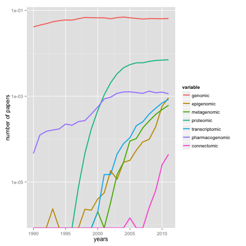

Searching metadata
========================================================

We offer several ways to search metadata, `rmetadata`, and `rentrez`


```r
# install_github('rentrez','ropensci')
# install_github('rmetadata','ropensci')
# install_github('rcrossref','ropensci')

```


Let's start by searching for terms with rmetadata from the crossref database.


```r
options(stringsAsFactors = F)
library(rcrossref)
library(rmetadata)
```

```
## Warning: replacing previous import by 'plyr::here' when loading 'rmetadata'
## Warning: replacing previous import by 'reshape::rename' when loading 'rmetadata'
## Warning: replacing previous import by 'reshape::round_any' when loading 'rmetadata'
## Warning: replacing previous import by 'reshape::stamp' when loading 'rmetadata'
## Warning: replacing previous import by 'plyr::compact' when loading 'rmetadata'
```

```
## 
## Attaching package: 'rmetadata'
## 
## The following objects are masked from 'package:rcrossref':
## 
##     crossref_citation, crossref_r, crossref_search,
##     crossref_search_free
```

```r
library(rentrez)

toxo <- crossref_search(q = "toxoplasmosis")
```

```
## Loading required package: rjson
```

```r

## We can also extend these to search by year, and change the number of
## records we have

toxo2 <- crossref_search(q = "toxoplasmosis", rows = 100, year = 2010)


### we can view these records

toxo2[34, ]$doi
```

```
## [1] "http://dx.doi.org/10.1203/00006450-201011001-00875"
```

```r
toxo2[34, ]$fullCitation
```

```
## [1] "B Lipka, B Milewska-Bobula, M Filipek, 2010, '875 Plasma Concentration of Pyrimethamine in Infants Treated for Congenital Toxoplasmosis', <i>Pediatric Research</i>, vol. 68, pp. 439-439"
```

```r

### Doi's come back with http appended, let's strip it off
toxo2$doi_nohttp <- gsub("http://dx.doi.org/", "", toxo2$doi)

# We can also see the full citation
print(crossref_citation("10.1016/j.cub.2013.11.014"), style = "Bibtex")
```

```
## @Article{,
##   title = {The Availability of Research Data Declines Rapidly with Article Age},
##   author = {Timothy H. Vines and Arianne Y.K. Albert and Rose L. Andrew and Florence Débarre and Dan G. Bock and Michelle T. Franklin and Kimberly J. Gilbert and Jean-Sébastien Moore and Sébastien Renaut and Diana J. Rennison},
##   journal = {Current Biology},
##   year = {2014},
##   month = {01},
##   volume = {24},
##   doi = {10.1016/j.cub.2013.11.014},
## }
```

```r
print(crossref_citation(toxo2$doi_nohttp[55]))
```

```
## SAUER A, SCHOLLER M, SPEEG C, GARWEG J, PFAFF A, CANDOLFI E and
## BOURCIER T (2010). "Efficacy of IL-17A mAbs on Toxoplasma gondii
## proliferation and intraocular inflammation in a murine model of
## ocular toxoplasmosis." _Acta Ophthalmologica_, *88*. <URL:
## http://dx.doi.org/10.1111/j.1755-3768.2010.4453.x>.
```

```r

```


We can also search pubmed abstracts with the [`rentrez`](https://github.com/ropensci/rentrez) package


```r
dmagna <- entrez_search(db = "pubmed", term = "Daphnia magna", retmax = 1000)


papers_by_year <- function(years, search_term) {
    return(sapply(years, function(y) entrez_search(db = "pubmed", term = search_term, 
        mindate = y, maxdate = y, retmax = 0)$count))
}

years <- 1990:2011
total_papers <- papers_by_year(years, "")
omics <- c("genomic", "epigenomic", "metagenomic", "proteomic", "transcriptomic", 
    "pharmacogenomic", "connectomic")
trend_data <- sapply(omics, function(t) papers_by_year(years, t))
trend_props <- data.frame(trend_data/total_papers)
trend_props$years <- years

trend_df <- melt(as.data.frame(trend_props), id.vars = "years")
p <- ggplot(trend_df, aes(years, value, colour = variable))
p + geom_line(size = 1) + scale_y_log10("number of papers")
```

 

```r

```


