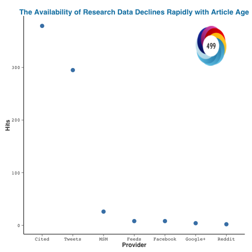
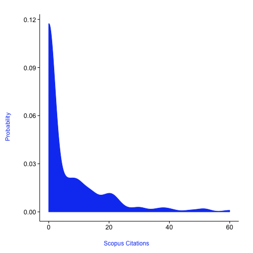
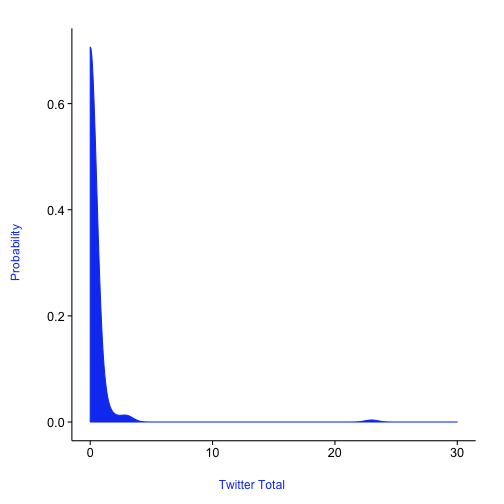

Altmetrics
========================================================
Altmetrics are other ways of measuring impact of a publication beyond just citation metrics such as the h-index.  For an example see [this story about altmetrics from the Chronicle of Higher-Ed](http://chronicle.com/article/Rise-of-Altmetrics-Revives/139557/)

```r
library(rAltmetric)
library(alm)
library(rentrez)
library(rplos)
library(plyr)

options(PlosApiKey = "3pezRBRXdyzYW6ztfwft")

### We can get the altmetric data for a given doi
vines <- altmetrics(doi = "10.1016/j.cub.2013.11.014")
plot(vines)
```

 

```r
# extract particular aspects like tweets See all the data
altmetric_data(vines)
```

```
##                                                                 title
## 2 The Availability of Research Data Declines Rapidly with Article Age
##                         doi nlmid            altmetric_jid
## 2 10.1016/j.cub.2013.11.014    na 4f6fa4ea3cf058f610002660
##                 issns         journal altmetric_id schema is_oa
## 2 09609822,0960-9822, Current Biology      1992755  1.5.4 FALSE
##   publisher_subjects.name publisher_subjects.scheme
## 2     Biological Sciences                       era
##     publisher_subjects.name.1 publisher_subjects.scheme.1
## 2 Medical And Health Sciences                         era
##           publisher_subjects.name.2 publisher_subjects.scheme.2
## 2 Psychology And Cognitive Sciences                         era
##   cited_by_gplus_count cited_by_fbwalls_count cited_by_posts_count
## 2                    4                      8                  379
##   cited_by_tweeters_count cited_by_accounts_count cited_by_feeds_count
## 2                     295                     343                    8
##   cited_by_rdts_count cited_by_msm_count cited_by_delicious_count
## 2                   2                 26                       NA
##   cited_by_forum_count cited_by_qs_count cited_by_rh_count score mendeley
## 2                   NA                NA                NA 498.7       60
##   connotea citeulike                                         url  added_on
## 2        0         5 http://dx.doi.org/10.1016/j.cub.2013.11.014 1.387e+09
##   published_on subjects
## 2    1.386e+09        ,
##                                                                                       scopus_subjects
## 2 Biochemistry, Genetics and Molecular Biology, Life Sciences, Agricultural and Biological Sciences, 
##   last_updated readers_count
## 2   1393521114            65
##                                                details_url
## 2 http://www.altmetric.com/details.php?citation_id=1992755
```

```r
vines$cited_by_tweeters_count
```

```
## [1] 295
```

```r

```


Papers can searched via lists of doi's


```r

dois <- c("10.1038/nature09210", "10.1126/science.1187820", "10.1016/j.tree.2011.01.009", 
    "10.1086/664183")
doi_list <- paste0("doi", "/", dois)
raw_metrics <- llply(doi_list, altmetrics, .progress = "text")
```

```
## 
  |                                                                       
  |                                                                 |   0%
  |                                                                       
  |================                                                 |  25%
  |                                                                       
  |================================                                 |  50%
  |                                                                       
  |=================================================                |  75%
  |                                                                       
  |=================================================================| 100%
```

```r
metric_data <- ldply(raw_metrics, altmetric_data)
metric_data[, names(metric_data) %in% c("title", "journal", "mendeley")]
```

```
##                                                                                       title
## 1   Coupled dynamics of body mass and population growth in response to environmental change
## 2 Stochastic community assembly causes higher biodiversity in more productive environments.
## 3                            Why intraspecific trait variation matters in community ecology
## 4                                            Enemies Maintain Hyperdiverse Tropical Forests
##                         journal mendeley
## 1                        Nature      291
## 2      Science (New York, N.Y.)      428
## 3 Trends in Ecology & Evolution      622
## 4       The American Naturalist       93
```


We can then search for certain for certain terms and see how many tweets they get.  Here we'll examine how many times a paper about a given topic was tweeted about


```r
# here's our omics list
omics <- c("genomic", "epigenomic", "metagenomic", "proteomic", "transcriptomic", 
    "pharmacogenomic", "connectomic")

### Function to return mean tweet
omics_tweets <- function(search_term) {
    pmids <- entrez_search(db = "pubmed", term = search_term, mindate = 2012, 
        maxdate = 2012, retmax = 50)$ids
    return(mean(unlist(sapply(pmids, function(x) altmetrics(pmid = x)$cited_by_tweeters_count))))
}

(out <- sapply(omics, omics_tweets))
```

```
##         genomic      epigenomic     metagenomic       proteomic 
##           3.000           2.611           7.167           2.680 
##  transcriptomic pharmacogenomic     connectomic 
##           6.824           2.000           8.188
```

```r

```


PLoS has a very robust API that allows access to article level metrics in PLoS. We'll introduce `rplos` and `alm` packages.


```r

## Let's do some basic queries where we can get back id's and titles.  We
## will also use this for full text
pmg <- searchplos(terms = "pharmacogenomic", field = c("id", "title", "abstract"), 
    limit = 300)

out <- alm(doi = pmg$id[30], info = "detail")
out
```

```
## $totals
##                       .id pdf html shares groups comments likes citations
## 1               citeulike  NA   NA      0     NA       NA    NA        NA
## 2                crossref  NA   NA     NA     NA       NA    NA         0
## 3                  nature  NA   NA     NA     NA       NA    NA         0
## 4                  pubmed  NA   NA     NA     NA       NA    NA         0
## 5                  scopus  NA   NA     NA     NA       NA    NA         0
## 6                 counter  78  451     NA     NA       NA    NA        NA
## 7        researchblogging  NA   NA     NA     NA       NA    NA         0
## 8                     wos  NA   NA     NA     NA       NA    NA         0
## 9                     pmc  44  110     NA     NA       NA    NA        NA
## 10               facebook  NA   NA      0     NA        0     0        NA
## 11               mendeley  NA   NA      1      0       NA    NA        NA
## 12                twitter  NA   NA     NA     NA        1    NA        NA
## 13              wikipedia  NA   NA     NA     NA       NA    NA         0
## 14          scienceseeker  NA   NA     NA     NA       NA    NA         0
## 15         relativemetric  NA   NA     NA     NA       NA    NA        NA
## 16                  f1000  NA   NA     NA     NA       NA    NA         0
## 17               figshare   0    1     NA     NA       NA     0        NA
## 18              pmceurope  NA   NA     NA     NA       NA    NA         0
## 19          pmceuropedata  NA   NA     NA     NA       NA    NA         0
## 20            openedition  NA   NA     NA     NA       NA    NA         0
## 21              wordpress  NA   NA     NA     NA       NA    NA         0
## 22                 reddit  NA   NA     NA     NA       NA    NA         0
## 23               datacite  NA   NA     NA     NA       NA    NA         0
## 24             copernicus  NA   NA     NA     NA       NA    NA        NA
## 25        articlecoverage  NA   NA     NA     NA       NA    NA         0
## 26 articlecoveragecurated  NA   NA     NA     NA       NA    NA         0
## 27          plos_comments  NA   NA     NA     NA       NA    NA         0
##    total
## 1      0
## 2      0
## 3      0
## 4      0
## 5      0
## 6    542
## 7      0
## 8      0
## 9    154
## 10     0
## 11     1
## 12     1
## 13     0
## 14     0
## 15  3032
## 16     0
## 17     1
## 18     0
## 19     0
## 20     0
## 21     0
## 22     0
## 23     0
## 24     0
## 25     0
## 26     0
## 27     0
## 
## $history
##                        .id      dates totals
## 1                citeulike 2014-02-26      0
## 2                citeulike 2014-02-14      0
## 3                citeulike 2014-02-06      0
## 4                citeulike 2014-01-28      0
## 5                 crossref 2014-02-24      0
## 6                 crossref 2014-02-12      0
## 7                 crossref 2014-02-04      0
## 8                 crossref 2014-01-26      0
## 9                   nature 2014-02-06      0
## 10                  pubmed 2014-02-25      0
## 11                  pubmed 2014-02-14      0
## 12                  pubmed 2014-02-06      0
## 13                  scopus 2014-01-26      0
## 14                 counter 2014-02-27    542
## 15                 counter 2014-02-26    535
## 16                 counter 2014-02-25    535
## 17                 counter 2014-02-24    535
## 18                 counter 2014-02-23    534
## 19                 counter 2014-02-22    534
## 20                 counter 2014-02-21    532
## 21                 counter 2014-02-20    528
## 22                 counter 2014-02-19    528
## 23                 counter 2014-02-18    528
## 24                 counter 2014-02-17    528
## 25                 counter 2014-02-16    526
## 26                 counter 2014-02-15    524
## 27                 counter 2014-02-14    522
## 28                 counter 2014-02-13    520
## 29                 counter 2014-02-12    519
## 30                 counter 2014-02-11    519
## 31                 counter 2014-02-10    517
## 32                 counter 2014-02-09    516
## 33                 counter 2014-02-08    516
## 34                 counter 2014-02-07    515
## 35                 counter 2014-02-06    515
## 36                 counter 2014-02-05    515
## 37                 counter 2014-02-04    514
## 38                 counter 2014-02-03    514
## 39                 counter 2014-02-02    514
## 40                 counter 2014-02-01    514
## 41                 counter 2014-01-31    514
## 42                 counter 2014-01-30    514
## 43                 counter 2014-01-29    514
## 44                 counter 2014-01-27    512
## 45                 counter 2014-01-26    512
## 46                 counter 2014-01-25    508
## 47                     wos 2014-02-19      0
## 48                     wos 2014-02-11      0
## 49                     wos 2014-02-03      0
## 50                     wos 2014-01-26      0
## 51                     pmc 2014-02-06    154
## 52                     pmc 2014-01-24    136
## 53                facebook 2014-02-21      0
## 54                facebook 2014-01-30      0
## 55                facebook 2014-01-25      0
## 56                mendeley 2014-02-21      1
## 57                 twitter 2014-02-25      1
## 58                 twitter 2014-02-17      1
## 59                 twitter 2014-02-09      1
## 60                 twitter 2014-02-01      1
## 61                 twitter 2014-01-24      1
## 62               wikipedia 2014-02-19      0
## 63               wikipedia 2014-02-11      0
## 64               wikipedia 2014-02-02      0
## 65               wikipedia 2014-01-25      0
## 66           scienceseeker 2014-02-06      0
## 67          relativemetric 2014-02-09   3032
## 68          relativemetric 2014-01-24   3732
## 69                   f1000 2014-02-19      0
## 70                   f1000 2014-02-11      0
## 71                   f1000 2014-02-02      0
## 72                   f1000 2014-01-25      0
## 73                figshare 2014-02-19      1
## 74                figshare 2014-02-11      1
## 75                figshare 2014-02-02      1
## 76                figshare 2014-01-25      1
## 77               pmceurope 2014-02-25      0
## 78               pmceurope 2014-02-17      0
## 79               pmceurope 2014-02-08      0
## 80               pmceurope 2014-02-01      0
## 81           pmceuropedata 2014-02-25      0
## 82           pmceuropedata 2014-02-17      0
## 83           pmceuropedata 2014-02-09      0
## 84           pmceuropedata 2014-02-01      0
## 85               wordpress 2014-02-01      0
## 86                  reddit 2014-02-17      0
## 87                  reddit 2014-02-09      0
## 88                  reddit 2014-02-01      0
## 89                datacite 2014-02-19      0
## 90                datacite 2014-02-11      0
## 91                datacite 2014-02-02      0
## 92                datacite 2014-01-25      0
## 93         articlecoverage 2014-02-19      0
## 94         articlecoverage 2014-02-11      0
## 95         articlecoverage 2014-02-03      0
## 96         articlecoverage 2014-01-25      0
## 97  articlecoveragecurated 2014-02-26      0
## 98  articlecoveragecurated 2014-02-21      0
## 99  articlecoveragecurated 2014-02-20      0
## 100 articlecoveragecurated 2014-02-18      0
## 101 articlecoveragecurated 2014-02-17      0
## 102 articlecoveragecurated 2014-02-16      0
## 103 articlecoveragecurated 2014-02-14      0
## 104 articlecoveragecurated 2014-02-13      0
## 105 articlecoveragecurated 2014-02-11      0
## 106 articlecoveragecurated 2014-02-10      0
## 107 articlecoveragecurated 2014-02-09      0
## 108 articlecoveragecurated 2014-02-07      0
## 109 articlecoveragecurated 2014-02-06      0
## 110 articlecoveragecurated 2014-02-04      0
## 111 articlecoveragecurated 2014-02-03      0
## 112 articlecoveragecurated 2014-02-01      0
## 113 articlecoveragecurated 2014-01-31      0
## 114 articlecoveragecurated 2014-01-30      0
## 115 articlecoveragecurated 2014-01-28      0
## 116 articlecoveragecurated 2014-01-26      0
## 117 articlecoveragecurated 2014-01-25      0
```

```r


out <- alm(doi = "10.1371/journal.pone.0000005", info = "detail")
almplot(out, type = "history")  # just totalmetrics data
```

 

```r

### We can also look at total details:
out <- alm(doi = pmg$id[20], info = "detail")
out
```

```
## $totals
##                       .id pdf html shares groups comments likes citations
## 1               citeulike  NA   NA      0     NA       NA    NA        NA
## 2                crossref  NA   NA     NA     NA       NA    NA         6
## 3                  nature  NA   NA     NA     NA       NA    NA         0
## 4                  pubmed  NA   NA     NA     NA       NA    NA         8
## 5                  scopus  NA   NA     NA     NA       NA    NA         8
## 6                 counter 490 2346     NA     NA       NA    NA        NA
## 7        researchblogging  NA   NA     NA     NA       NA    NA         0
## 8                     wos  NA   NA     NA     NA       NA    NA         9
## 9                     pmc 300  596     NA     NA       NA    NA        NA
## 10               facebook  NA   NA      0     NA        0     0        NA
## 11               mendeley  NA   NA     30      0       NA    NA        NA
## 12                twitter  NA   NA     NA     NA        0    NA        NA
## 13              wikipedia  NA   NA     NA     NA       NA    NA         0
## 14          scienceseeker  NA   NA     NA     NA       NA    NA         0
## 15         relativemetric  NA   NA     NA     NA       NA    NA        NA
## 16                  f1000  NA   NA     NA     NA       NA    NA         0
## 17               figshare   0    1     NA     NA       NA     0        NA
## 18              pmceurope  NA   NA     NA     NA       NA    NA         8
## 19          pmceuropedata  NA   NA     NA     NA       NA    NA         0
## 20            openedition  NA   NA     NA     NA       NA    NA         0
## 21              wordpress  NA   NA     NA     NA       NA    NA         0
## 22                 reddit  NA   NA     NA     NA       NA    NA         0
## 23               datacite  NA   NA     NA     NA       NA    NA         0
## 24             copernicus  NA   NA     NA     NA       NA    NA        NA
## 25        articlecoverage  NA   NA     NA     NA       NA    NA         0
## 26 articlecoveragecurated  NA   NA     NA     NA       NA    NA         0
## 27          plos_comments  NA   NA     NA     NA       NA    NA         0
##     total
## 1       0
## 2       6
## 3       0
## 4       8
## 5       8
## 6    2861
## 7       0
## 8       9
## 9     896
## 10      0
## 11     30
## 12      0
## 13      0
## 14      0
## 15 240186
## 16      0
## 17      1
## 18      8
## 19      0
## 20      0
## 21      0
## 22      0
## 23      0
## 24      0
## 25      0
## 26      0
## 27      0
## 
## $history
##                       .id      dates totals
## 1               citeulike 2014-01-26      0
## 2                crossref 2014-01-25      6
## 3                  nature 2014-01-27      0
## 4                  pubmed 2014-01-25      8
## 5                  scopus 2014-02-03      8
## 6                 counter 2014-02-27   2861
## 7                 counter 2014-02-26   2861
## 8                 counter 2014-02-25   2861
## 9                 counter 2014-02-24   2861
## 10                counter 2014-02-23   2861
## 11                counter 2014-02-22   2857
## 12                counter 2014-02-21   2856
## 13                counter 2014-02-20   2855
## 14                counter 2014-02-19   2853
## 15                counter 2014-02-18   2853
## 16                counter 2014-02-17   2853
## 17                counter 2014-02-16   2853
## 18                counter 2014-02-15   2853
## 19                counter 2014-02-14   2853
## 20                counter 2014-02-13   2853
## 21                counter 2014-02-12   2853
## 22                counter 2014-02-11   2852
## 23                counter 2014-02-10   2849
## 24                counter 2014-02-09   2849
## 25                counter 2014-02-08   2849
## 26                counter 2014-02-07   2847
## 27                counter 2014-02-06   2847
## 28                counter 2014-02-05   2847
## 29                counter 2014-02-04   2847
## 30                counter 2014-02-03   2847
## 31                counter 2014-02-02   2847
## 32                counter 2014-02-01   2847
## 33                counter 2014-01-31   2847
## 34                counter 2014-01-30   2847
## 35                counter 2014-01-29   2846
## 36                counter 2014-01-28   2846
## 37                counter 2014-01-27   2846
## 38                counter 2014-01-26   2846
## 39                counter 2014-01-25   2846
## 40       researchblogging 2014-02-06      0
## 41                    wos 2014-01-31      9
## 42                    pmc 2014-02-06    896
## 43                    pmc 2014-01-24    889
## 44               facebook 2014-01-30      0
## 45               facebook 2014-01-25      0
## 46               mendeley 2014-01-24     30
## 47              wikipedia 2014-01-24      0
## 48          scienceseeker 2014-01-27      0
## 49         relativemetric 2014-02-09 240186
## 50         relativemetric 2014-01-24 147829
## 51                  f1000 2014-01-24      0
## 52               figshare 2014-02-26      1
## 53               figshare 2014-01-25      1
## 54              pmceurope 2014-01-31      8
## 55          pmceuropedata 2014-01-31      0
## 56              wordpress 2014-01-27      0
## 57                 reddit 2014-01-27      0
## 58               datacite 2014-01-25      0
## 59        articlecoverage 2014-02-26      0
## 60        articlecoverage 2014-01-25      0
## 61 articlecoveragecurated 2014-02-26      0
## 62 articlecoveragecurated 2014-02-21      0
## 63 articlecoveragecurated 2014-02-20      0
## 64 articlecoveragecurated 2014-02-18      0
## 65 articlecoveragecurated 2014-02-17      0
## 66 articlecoveragecurated 2014-02-16      0
## 67 articlecoveragecurated 2014-02-14      0
## 68 articlecoveragecurated 2014-02-13      0
## 69 articlecoveragecurated 2014-02-11      0
## 70 articlecoveragecurated 2014-02-10      0
## 71 articlecoveragecurated 2014-02-09      0
## 72 articlecoveragecurated 2014-02-07      0
## 73 articlecoveragecurated 2014-02-06      0
## 74 articlecoveragecurated 2014-02-04      0
## 75 articlecoveragecurated 2014-02-03      0
## 76 articlecoveragecurated 2014-02-01      0
## 77 articlecoveragecurated 2014-01-31      0
## 78 articlecoveragecurated 2014-01-30      0
## 79 articlecoveragecurated 2014-01-28      0
## 80 articlecoveragecurated 2014-01-27      0
## 81 articlecoveragecurated 2014-01-25      0
## 82 articlecoveragecurated 2014-01-24      0
```

```r

## We could also look at metrics by time period.  Here's a very highly cited
## plos medicine paper

out <- alm(doi = "10.1371/journal.pmed.0020124", sum_metrics = "year")
head(out)
```

```
##         .id year pdf html shares groups comments likes citations total  x
## 1 citeulike 2005  NA   NA     10     NA       NA    NA        NA    10 NA
## 2 citeulike 2006  NA   NA     15     NA       NA    NA        NA    15 NA
## 3 citeulike 2007  NA   NA     18     NA       NA    NA        NA    18 NA
## 4 citeulike 2008  NA   NA     28     NA       NA    NA        NA    28 NA
## 5 citeulike 2009  NA   NA     74     NA       NA    NA        NA    74 NA
## 6 citeulike 2010  NA   NA    110     NA       NA    NA        NA   110 NA
```

```r

# now let's make a javascript plot with cumulative citations since 2006.
# Subset out the data
out <- out[out$.id %in% "crossref", ]
plot(out$year, cumsum(out$citations))
```

 

```r
citedata <- data.frame(cbind(out$year, cumsum(out$citations)))
colnames(citedata) <- c("Year", "Cumulative citations")

### Plot using rCharts
cite_plot <- mPlot(x = "Year", y = "Cumulative citations", data = citedata, 
    type = "Line")
```

```
## Error: could not find function "mPlot"
```

```r

### Can be customized with this guide: http://t.co/hA6sdFzVI3 If you want to
### write this out and use it in an iFrame cite_plot$save('mychart.html', cdn
### = TRUE)


### Get event data
out <- almevents(doi = "10.1371/journal.pone.0053788")
### remove sources that have no data
out <- out[!out %in% c("sorry, no events content yet", "parser not written yet")]
## See sources available
names(out)
```

```
##  [1] "crossref"       "scopus"         "counter"        "wos"           
##  [5] "pmc"            "mendeley"       "twitter"        "relativemetric"
##  [9] "figshare"       "wordpress"      "plos_comments"
```

```r

## See all tweets
out$twitter[1:3, ]
```

```
##                   id
## 1 289802563170213888
## 2 291666412680921089
## 3 291666652049842176
##                                                                                                                                      text
## 1 Your allergies been worse last few yrs?  #ClimateChange is making flowers bloom earlier -- earliest EVER last year http://t.co/zZQp8B1D
## 2                    Warmest spring on record causes earliest flowering ever observed in eastern U.S. (via @PLOSONE) http://t.co/HwnqKZGp
## 3                                     Warmest spring on record causes earliest flowering ever observed in eastern US http://t.co/HSWYpKgx
##                        created_at           user      user_name
## 1  Fri Jan 11 18:34:49 +0000 2013 Laurie_Garrett Laurie Garrett
## 2  Wed Jan 16 22:01:06 +0000 2013    sethmnookin   Seth Mnookin
## 3 Wed, 16 Jan 2013 22:02:03 +0000        PLOSONE       PLOS ONE
##                                                                          user_profile_image
## 1                          http://a0.twimg.com/profile_images/1355060739/Laurie2_normal.jpg
## 2 http://a0.twimg.com/profile_images/2895645801/d556ecf78b6c4483f4d2856836d8a09f_normal.png
## 3            http://a0.twimg.com/profile_images/2429958559/mzjl6as5u2m09r2erof6_normal.jpeg
```

```r
## See all other papers that cited this paper in crossref
out$crossref
```

```
##                   issn                           journal_title
## 1             0028646X                         New Phytologist
## 2 0020-7128; 1432-1254 International Journal of Biometeorology
## 3 0020-7128; 1432-1254 International Journal of Biometeorology
##   journal_abbreviation
## 1           New Phytol
## 2    Int J Biometeorol
## 3    Int J Biometeorol
##                                                                                                 article_title
## 1 Drivers of leaf-out phenology and their implications for species invasions: insights from Thoreau's Concord
## 2                                     Phenology research for natural resource management in the United States
## 3                                      Cranberry flowering times and climate change in southern Massachusetts
##                                                                                   contributor
## 1                                        Caroline Polgar; Amanda Gallinat; Richard B. Primack
## 2 Carolyn A. F. Enquist; Jherime L. Kellermann; Katharine L. Gerst; Abraham J. Miller-Rushing
## 3             Elizabeth R. Ellwood; Susan R. Playfair; Caroline A. Polgar; Richard B. Primack
##   first_page year publication_type                       doi fl_count
## 1        n/a 2013        full_text         10.1111/nph.12647        0
## 2       <NA> 2014        full_text 10.1007/s00484-013-0772-6        0
## 3       <NA> 2013        full_text 10.1007/s00484-013-0719-y        0
```

```r


### 
```


Lastly we can take a selection of DOI's and see how many citations the recieved.


```r

dois <- searchplos(terms = "proteomics", fields = "id", toquery = list("cross_published_journal_key:PLoSONE", 
    "doc_type:full", "publication_date:[2010-01-01T00:00:00Z TO 2010-12-31T23:59:59Z]"), 
    limit = 200)

### Remove non full article DOI's
dois <- dois$id
dois <- dois[!grepl("annotation", dois)]

### Get data on all DOI's
out <- alm(doi = dois, total_details = TRUE)
out <- ldply(out)
### See a density plot of all crossref citations, scopus citations, and tweets
plot_density(input = out, source = "crossref_citations")
```

 

```r
plot_density(input = out, source = "scopus_citations")
```

 

```r
plot_density(input = out, source = "twitter_total")
```

 

```r

```


