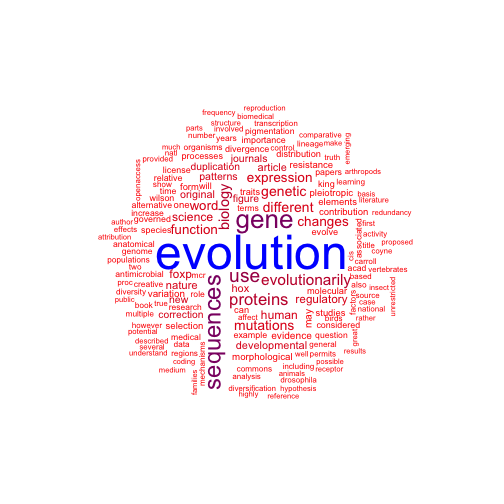
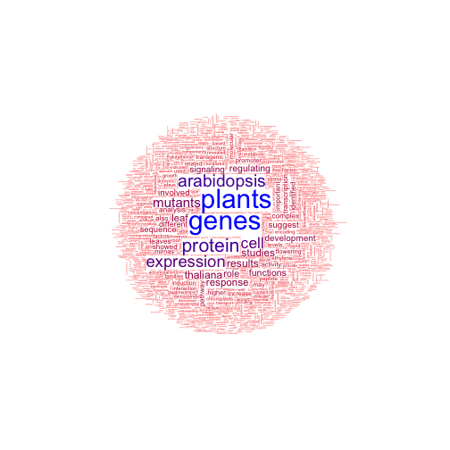
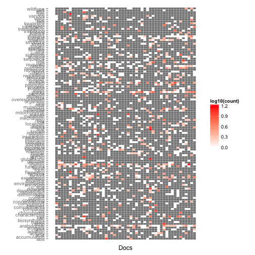

Text mining
========================================================
There is a lot to text mining, and we will only cover some basics.  It can be computationally very intensive, and sources require a reasonable amount of munging to be wrangled into a usable state.  So we'll start simple.


```r
library(rplos)
library(tm)
library(wordcloud)
library(ggplot2)


### We can get the full text for a plos article with rplos.  Grab full text
a_text <- searchplos("evolution", fields = c("everything"), limit = 10)

### Now we need to make a term document matrix.


# Create a corpus of words
plos_corpus <- Corpus(VectorSource(a_text$everything))

# Here we'll lowercase everything, strip punctionation, and remove stop
# words

plos_corpus <- tm_map(plos_corpus, tolower)
plos_corpus <- tm_map(plos_corpus, removePunctuation)
plos_corpus <- tm_map(plos_corpus, removeNumbers)

### Create stopwords list and strip them out
myStopwords <- c(stopwords("english"), "available", "via")
plos_corpus <- tm_map(plos_corpus, removeWords, myStopwords)


### Stem the words
dictCorpus <- plos_corpus
plos_corpus <- tm_map(plos_corpus, stemDocument)
plos_corpus <- tm_map(plos_corpus, stemCompletion, dictionary = dictCorpus)


### Next we create out term document matrix
plos_tdm <- TermDocumentMatrix(plos_corpus, control = list(minWordLength = 2))

### We can now do fun things Check and see what frequent terms were found
findFreqTerms(plos_tdm, lowfreq = 30)
```

```
##  [1] "article"        "biology"        "changes"        "developmental" 
##  [5] "different"      "evolution"      "evolutionarily" "expression"    
##  [9] "foxp"           "function"       "gene"           "genetic"       
## [13] "hox"            "human"          "mutations"      "nature"        
## [17] "original"       "patterns"       "proteins"       "regulatory"    
## [21] "science"        "sequences"      "use"            "word"
```

```r


### Find associations
findAssocs(plos_tdm, "data", 0.75)
```

```
##                     data
## acquire             1.00
## andor               1.00
## arise               1.00
## bias                1.00
## brief               1.00
## decreased           1.00
## diseases            1.00
## efforts             1.00
## engineering         1.00
## essay               1.00
## essential           1.00
## establish           1.00
## favor               1.00
## fundamental         1.00
## hered               1.00
## idea                1.00
## inform              1.00
## longer              1.00
## moreover            1.00
## news                1.00
## opportune           1.00
## outcomes            1.00
## past                1.00
## patients            1.00
## proposed            1.00
## respectively        1.00
## shown               1.00
## since               1.00
## thank               1.00
## type                1.00
## valuable            1.00
## biologists          0.99
## directly            0.99
## general             0.99
## classified          0.98
## component           0.98
## evolutionarily      0.98
## explicitly          0.98
## highly              0.98
## indeed              0.98
## pair                0.98
## rather              0.98
## reflected           0.98
## science             0.98
## standard            0.98
## also                0.97
## journalpbiog        0.97
## significant         0.96
## allele              0.94
## appear              0.94
## correspondence      0.94
## documented          0.94
## dramatically        0.94
## economic            0.94
## figure              0.94
## fitness             0.94
## followed            0.94
## force               0.94
## help                0.94
## length              0.94
## made                0.94
## mark                0.94
## mentioned           0.94
## obtain              0.94
## point               0.94
## provided            0.94
## relationship        0.94
## series              0.94
## slowly              0.94
## biology             0.93
## noted               0.93
## review              0.93
## use                 0.93
## including           0.92
## processes           0.92
## emerging            0.91
## increase            0.91
## means               0.91
## critical            0.90
## institute           0.90
## repeated            0.90
## whether             0.88
## activity            0.87
## architecture        0.87
## commons             0.87
## correlated          0.87
## differential        0.87
## evolution           0.87
## examine             0.87
## importance          0.87
## independent         0.87
## long                0.87
## mode                0.87
## press               0.87
## rare                0.87
## reports             0.87
## survey              0.87
## changes             0.85
## license             0.85
## may                 0.85
## academic            0.83
## another             0.83
## contrast            0.83
## highlights          0.83
## ignored             0.83
## results             0.83
## search              0.83
## sexual              0.83
## consequences        0.82
## one                 0.82
## described           0.81
## everyday            0.81
## find                0.81
## basis               0.80
## clear               0.80
## greater             0.80
## promoter            0.80
## systems             0.80
## time                0.80
## actual              0.79
## analysis            0.79
## based               0.79
## example             0.79
## genetic             0.79
## however             0.79
## involved            0.79
## relative            0.79
## area                0.78
## article             0.78
## evolve              0.78
## novel               0.78
## original            0.78
## range               0.78
## trends              0.78
## upon                0.78
## factors             0.77
## found               0.77
## phrases             0.77
## specific            0.77
## years               0.77
## america             0.76
## complete            0.76
## email               0.76
## focus               0.76
## infodoijournalpbiog 0.76
## investigations      0.76
## medical             0.76
## power               0.76
## scientific          0.76
## support             0.76
## united              0.76
## papers              0.75
## similarly           0.75
```

```r

### Now let's try and make a word cloud!  convert
m <- as.matrix(plos_tdm)

v <- sort(rowSums(m), decreasing = TRUE)
myNames <- names(v)
d <- data.frame(word = myNames, freq = v)
pal <- colorRampPalette(c("red", "blue"))(10)
wordcloud(d$word, d$freq, min.freq = 10, colors = pal, random.order = FALSE)
```

 


Text can be pulled from other sources as well, let's try it with pubmed abstracts


```r
pmids <- entrez_search(db = "pubmed", term = c("arabidopsis"), mindate = 2010, 
    maxdate = 2012, retmax = 50)$ids

out <- fetch_in_chunks(pmids)

### This object structure is admittedly byzantine, but this works to get all
### the abstracts out

abs_vec <- vector()
for (i in 1:length(out)) {
    abs_vec <- c(abs_vec, out[[i]]$MedlineCitation$Article$Abstract$AbstractText)
}

## Now we can apply the same techniques to make our word cloud


# Create a corpus of words
pubmed_corpus <- Corpus(VectorSource(abs_vec))

# Here we'll lowercase everything, strip punctionation, and remove stop
# words

pubmed_corpus <- tm_map(pubmed_corpus, tolower)
pubmed_corpus <- tm_map(pubmed_corpus, removePunctuation)
pubmed_corpus <- tm_map(pubmed_corpus, removeNumbers)

### Create stopwords list and strip them out
myStopwords <- c(stopwords("english"), "within", "nonprocessed")
pubmed_corpus <- tm_map(pubmed_corpus, removeWords, myStopwords)


### Stem the words ### This can take a long time, and maybe you don't want to
### do it
dictCorpus <- pubmed_corpus
pubmed_corpus <- tm_map(pubmed_corpus, stemDocument)
pubmed_corpus <- tm_map(pubmed_corpus, stemCompletion, dictionary = dictCorpus)

pubmed_tdm <- TermDocumentMatrix(pubmed_corpus, control = list(minWordLength = 3))

### Do this to remove sparse terms

# pubmed_tdm <- removeSparseTerms(pubmed_tdm, 0.4)


m <- as.matrix(pubmed_tdm)

v <- sort(rowSums(m), decreasing = TRUE)
myNames <- names(v)
d <- data.frame(word = myNames, freq = v)
pal <- colorRampPalette(c("red", "blue"))(10)
wordcloud(d$word, d$freq, scale = c(2.5, 0.1), min.freq = 1, colors = pal, random.order = FALSE)
```

 

```r

```


We can also build on our corpus with a plot that will look like a microarray. This will allow us to visualize associations between words and documents


```r
### Create a dense matrix and melt it
pubmed_dense <- as.matrix(pubmed_tdm)
### In case document numbers weren't assigned
colnames(pubmed_dense) <- 1:dim(pubmed_dense)[2]

pubmed_dense = melt(pubmed_dense, value.name = "count")

### The resulting plot will be unreadable so let's trim some terms out.  Trim
### out terms that are mentioned less than 10 times

highF_words <- findFreqTerms(pubmed_tdm, lowfreq = 10)

pubmed_dense <- pubmed_dense[pubmed_dense$Terms %in% highF_words, ]


ggplot(pubmed_dense, aes(x = Docs, y = Terms, fill = log10(count))) + geom_tile(colour = "white") + 
    scale_fill_gradient(high = "#FF0000", low = "#FFFFFF") + ylab("") + theme(panel.background = element_blank()) + 
    theme(axis.text.x = element_blank(), axis.ticks.x = element_blank())
```

 


